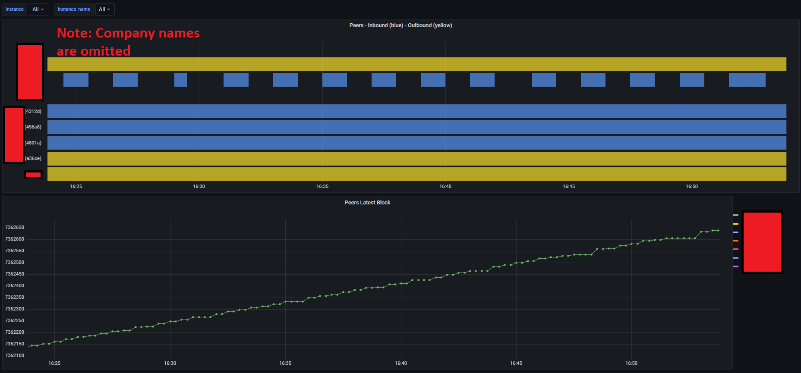

# Quorum Node Metrics Exporter

A Docker image based on a [Python script](./source/main.py) to provide additional metrics of a Quorum node in Prometheus format.

- Information about peers like "which peer is connected inbound or outbound" and "latest block of each peer"
- Information if the quorum node thats being monitored can establish an outbound  TCP connection to another peer (good for finding out firewall misconfigurations).

## Requirements

The quorum node to monitor must run on Kubernetes.

## Howto

1. Build the docker image, e.g. `docker build -t REGISTYR/REPO:TAG .`
2. Push to your registry - `docker push REGISTYR/REPO:TAG`
3. Deploy
  
    - Either deploy via [helm chart](https://github.com/PharmaLedger-IMI/helm-charts/tree/master/charts/quorum-node-metrics-exporter)
    - or manually:

        - Set the image `.spec.template.spec.containers[0].image` in file [deployment.yaml](./k8s/deployment.yaml).
        - Set `namespace`, `deployment`, `rpc_url` and  `peers` in file [configmap.yaml](./k8s/configmap.yaml).
        - Set the `metadata.namespace` in all Kubernetes yaml files. Must be deployed into the same namespace as Quorum is running!
        - Deploy to Kubernetes

            ```bash
              kubectl apply -n=my-custom-namespace k8s/configmap.yaml
              kubectl apply -n=my-custom-namespace k8s/rbac.yaml
              kubectl apply -n=my-custom-namespace k8s/deployment.yaml
            ```

        - In case you are using network policies, take a look at [netpol.yaml](./k8s/netpol.yaml) and modify the policies according to your needs.

## Grafana Dashboard

You can import the Grafana Dashboard from [here](./docs/grafana_dashboard_peers_overview.json)

Metrics are provided for current connected peers and for well known peers defined in the configuration. *Note*: The company names in the screenshot below are artifical and no real names.



## Metrics

- `quorum_peers`
  - Description: Quorum peers by enode
  - Labels: instance_name, enode, enode_short, name
  - Values:
    - `0` - not connected (but defined in config)
    - `1` - connected
- `quorum_peers_network_direction`
  - Description: Quorum peers network direction by enode
  - Labels: instance_name, enode, enode_short, name
  - Values:
    - `0` - not connected (but defined in config)
    - `1` - inbound traffix
    - `2` - outbound traffic
- `quorum_peers_head_block`
  - Description: Quorum peers head block by enode and protocol eth or istanbul
  - Labels: instance_name, enode, enode_short, name, protocol
  - Values: The latest block of the connected peer
- `quorum_tcp_egress_connectivity`:
  - Description: Quorum TCP egress connectivity to other nodes by enode.
  - Labels: instance_name, enode, enode_short, name
  - Values:
    - `0` - no connectivity/an outbound connection cannot be established
    - `1` - connection can be established

### Metric Labels

- `instance_name` - The host name of the Quorum node taken from RPC_URL
- `enode` - The 128 hex chars enode of the peer
- `enode_short` - The first 20 chars of the 128 hex chars enode
- `name` - The `company-name` as defined in `k8s/configmap.yaml`.
   In case a company-name is used for multiple peers, the generated `name` will be `company-name (first 5 chars of enode)`
   In case the peer is not defined in the config, the first 20 chars of the enode will be used.
- `protocol` - eth or istanbul

## Links

- [https://github.com/prometheus/client_python](https://github.com/prometheus/client_python)
- [https://getblock.io/docs/available-nodes-methods/ETH/JSON-RPC/admin_peers/](https://getblock.io/docs/available-nodes-methods/ETH/JSON-RPC/admin_peers/)
- [https://geth.ethereum.org/docs/rpc/ns-admin#admin_peers](https://geth.ethereum.org/docs/rpc/ns-admin#admin_peers)
- [https://consensys.net/docs/goquorum/en/latest/develop/connecting-to-a-node/](https://consensys.net/docs/goquorum/en/latest/develop/connecting-to-a-node/)
