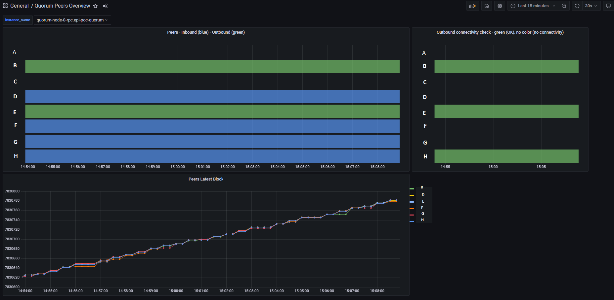

# Quorum Node Metrics Exporter

A Docker image based on a [Python script](main.py) to gather additional information about peers of a Quorum Node via the RPC endpoint and to provide metrics in Prometheus format.

## Howto

1. Build the docker image, e.g. `docker build -t REGISTYR/REPO:TAG .`
2. Push to your registry - `docker push REGISTYR/REPO:TAG`
3. There is no helm chart yet as of 2022-July-15 !
4. Set the image `.spec.template.spec.containers[0].image` in file [deployment.yaml](./k8s/deployment.yaml).
5. Set `rpc_url` and `peers` in file [configmap.yaml](./k8s/configmap.yaml).
6. Deploy to Kubernetes`

      ```bash
        kubectl apply -n=my-custom-namespace k8s/configmap.yaml
        kubectl apply -n=my-custom-namespace k8s/deployment.yaml
      ```

7. In case you are using network policies, take a look at [netpol.yaml](./k8s/netpol.yaml) and modify the policies according to your needs.

## Grafana Dashboard

You can import the Grafana Dashboard from [here](./docs/grafana_dashboard_peers_overview.json)

Metrics are only provided for current peers. If a peer is not connected, then there is no data for that peer.

See below:

- Between approx. 11:27 and 11:30 peer `5cc...` was not connected with our node.
- Between approx. 11:30 and 11:32 our node was not connected to any peer. Starting from 11:32 some peers connected to our node via an inbound connection.



## Metrics

- `quorum_peers`
  - Description: Quorum peers by enode
  - Labels: instance, instance_name, enode, enode_short, name
  - Values: 0=not connected (but defined in config), 1=connected
- `quorum_peers_network_direction`
  - Description: Quorum peers network direction by enode
  - Labels: instance, instance_name, enode, enode_short, name
  - Values: 0=not connected (but defined in config), 1=inbound traffix, 2=outbound traffic
- `quorum_peers_head_block`
  - Description: Quorum peers head block by enode and protocol eth or istanbul
  - Labels: instance, instance_name, enode, enode_short, name, protocol
  - Values: The latest block of the connected peer

### Metric Labels

- `instance` - The local IP address of the Quorum node followed by ':9545', e.g. `10.2.3.4:9545`
- `instance_name` - The host name of the Quorum node taken from RPC_URL
- `enode` - The 128 hex chars enode of the peer
- `enode_short` - The first 20 chars of the 128 hex chars enode
- `name` - The `company-name` as defined in `k8s/configmap.yaml`.
   In case a company-name is used for multiple peers, the generated `name` will be `company-name (first 5 chars of enode)`
   In case the peer is not defined in the config, the first 20 chars of the enode will be used.
- `protocol` - eth or istanbul

## Links

- [https://github.com/prometheus/client_python](https://github.com/prometheus/client_python)
- [https://getblock.io/docs/available-nodes-methods/ETH/JSON-RPC/admin_peers/](https://getblock.io/docs/available-nodes-methods/ETH/JSON-RPC/admin_peers/)
- [https://geth.ethereum.org/docs/rpc/ns-admin#admin_peers](https://geth.ethereum.org/docs/rpc/ns-admin#admin_peers)
- [https://consensys.net/docs/goquorum/en/latest/develop/connecting-to-a-node/](https://consensys.net/docs/goquorum/en/latest/develop/connecting-to-a-node/)
